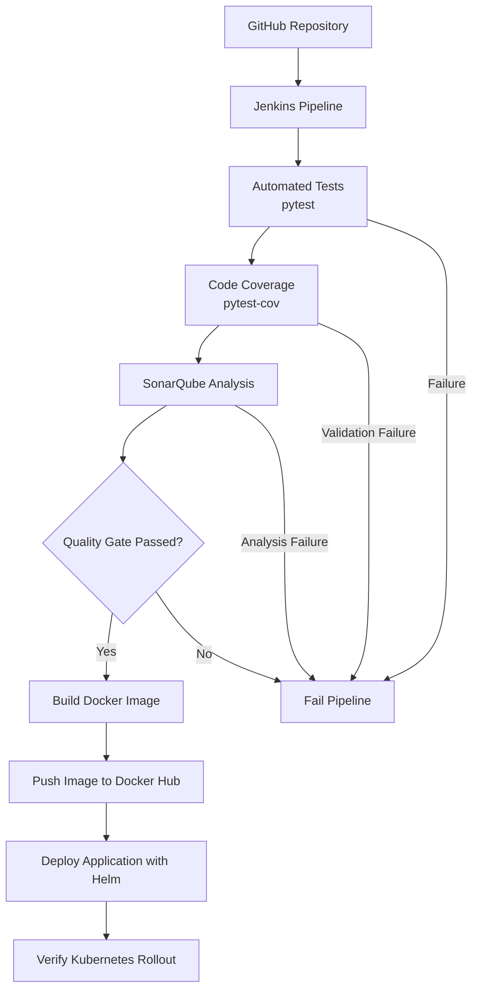
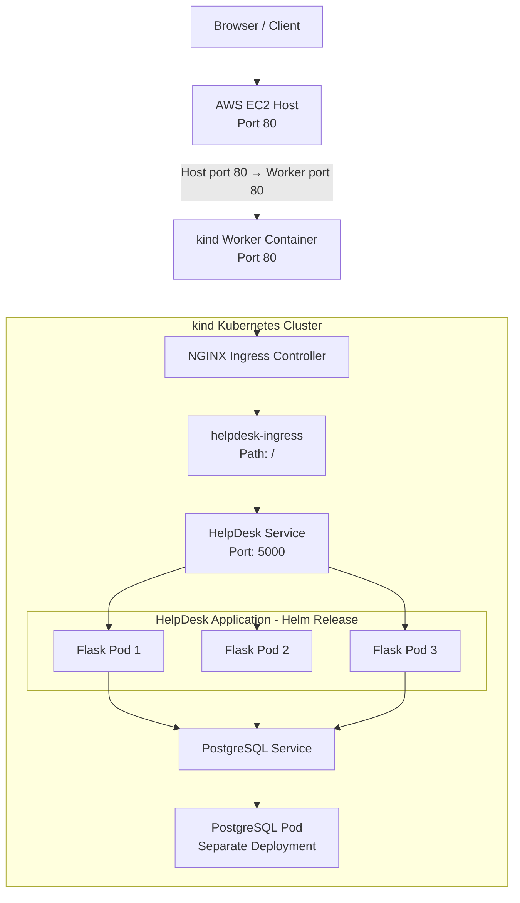

# HelpDesk Application — DevOps CI/CD Project

## 1. Project Overview

The HelpDesk Application is a web-based ticket management system developed using Flask and PostgreSQL. It enables customers to raise support tickets and allows support personnel to manage, take ownership of, and resolve tickets through a web interface.

The project demonstrates an end-to-end DevOps workflow designed to automate application testing, code quality analysis, container image creation, and Kubernetes deployment.

The application is integrated with a Jenkins CI/CD pipeline that uses GitHub for source code management, pytest for automated testing and code coverage, SonarQube for static code analysis and Quality Gate enforcement, Docker for containerization, Docker Hub for image storage, and Helm for Kubernetes application deployment.

The application is deployed on a two-node Kubernetes cluster created using kind (Kubernetes in Docker). NGINX Ingress handles HTTP traffic routing to the HelpDesk application. PostgreSQL runs as a separate Kubernetes Deployment and Service, independently of the application's Helm release.

A key objective of this project is to enforce a quality-controlled CI/CD process. The pipeline must pass the SonarQube Quality Gate before proceeding to Docker image publishing and application deployment. If the Quality Gate fails, the pipeline stops before these stages, preventing an unsuccessful quality assessment from progressing to deployment.

### Project Objectives

* Develop a functional ticket management application with separate customer and support workflows.
* Automate application testing and code coverage reporting using pytest.
* Integrate SonarQube static code analysis and Quality Gate enforcement into Jenkins.
* Build Docker images and publish them to Docker Hub only after the required quality checks pass.
* Deploy and manage application releases on Kubernetes using Helm.
* Maintain PostgreSQL as a separate Kubernetes Deployment and Service outside the application Helm release.
* Manage application configuration and sensitive credentials using environment variables, Jenkins Credentials, and Kubernetes Secrets.
* Demonstrate an end-to-end CI/CD workflow using practical DevOps tools and infrastructure.

## 2. Technology Stack

The HelpDesk project uses a combination of application development, automated testing, continuous integration and delivery, containerization, code quality analysis, and Kubernetes deployment technologies.

### 2.1 Application Development and Testing

| Technology | Purpose                                                                                                   |
| ---------- | --------------------------------------------------------------------------------------------------------- |
| Python     | Programming language used to develop the application.                                                     |
| Flask      | Lightweight web framework used to implement ticket management, authentication, and application endpoints. |
| PostgreSQL | Relational database used to store application users and support tickets.                                  |
| pytest     | Automates application tests to verify expected behavior and identify regressions.                         |
| pytest-cov | Measures and reports code coverage during automated testing.                                              |

### 2.2 Source Control and CI/CD

| Technology                | Purpose                                                                                                                     |
| ------------------------- | --------------------------------------------------------------------------------------------------------------------------- |
| Git                       | Tracks source code changes and supports version control.                                                                    |
| GitHub                    | Hosts the application repository and maintains the project history.                                                         |
| Jenkins                   | Orchestrates the CI/CD pipeline, including testing, quality checks, container image publishing, and application deployment. |
| SonarQube Community Build | Performs static code analysis and evaluates the project against the configured Quality Gate.                                |

SonarQube runs in a Docker container on the EC2 environment. The Jenkins pipeline connects to the running SonarQube instance to submit analysis results and enforce the Quality Gate before Docker image publishing and deployment.

### 2.3 Containerization and Image Management

| Technology | Purpose                                                                                 |
| ---------- | --------------------------------------------------------------------------------------- |
| Docker     | Packages the Flask application and its runtime dependencies into a container image.     |
| Docker Hub | Stores versioned application images so they can be retrieved for Kubernetes deployment. |

### 2.4 Kubernetes and Application Deployment

| Technology                  | Purpose                                                                                 |
| --------------------------- | --------------------------------------------------------------------------------------- |
| Kubernetes                  | Orchestrates application containers and manages application workloads.                  |
| kind (Kubernetes in Docker) | Provides the two-node Kubernetes cluster used for the project.                          |
| Helm                        | Packages and manages releases of the HelpDesk application and its Kubernetes resources. |
| NGINX Ingress Controller    | Routes incoming HTTP requests to the HelpDesk Kubernetes Service.                       |

The application is deployed through a Helm chart. PostgreSQL is maintained as a separate Kubernetes Deployment and Service, outside the application's Helm release.

### 2.5 Infrastructure and Configuration Management

| Technology            | Purpose                                                                                           |
| --------------------- | ------------------------------------------------------------------------------------------------- |
| AWS EC2               | Provides the project environment for Jenkins, SonarQube, Docker, and the kind Kubernetes cluster. |
| Jenkins Credentials   | Securely stores and supplies credentials and sensitive configuration required by pipeline steps.  |
| Kubernetes Secrets    | Stores sensitive Kubernetes configuration, including the database password.                       |
| Kubernetes ConfigMaps | Supplies non-sensitive configuration to Kubernetes workloads.                                     |

The project uses a single EC2 instance for the overall environment. The kind cluster runs its control-plane and worker nodes as containers on that environment.

### 2.6 Planned Technologies

The following technologies are potential future improvements and are not presented as implemented components of the current workflow:

* **Argo CD:** GitOps-based Kubernetes deployment and reconciliation.
* **Prometheus:** Metrics collection and monitoring.
* **Grafana:** Monitoring dashboards and visualization.
* **Additional security scanners:** Integration of tools for source code, dependency, container image, and application security testing, as appropriate for the project.

## 3. Architecture

The HelpDesk project runs on a single AWS EC2 instance that hosts the Jenkins CI/CD environment and a two-node Kubernetes cluster created using kind (Kubernetes in Docker). SonarQube runs as a Docker container on the same EC2 environment and provides static code analysis and Quality Gate validation during the CI/CD pipeline.

The architecture separates the CI/CD workflow from the application's runtime request flow. Jenkins automates application testing, code quality validation, Docker image publishing, and Helm-based application deployment. Within Kubernetes, NGINX Ingress routes incoming HTTP requests to the HelpDesk application, while PostgreSQL runs as a separate Kubernetes Deployment and Service outside the application's Helm release.

### 3.1 CI/CD Architecture

The CI/CD pipeline automates the journey from source code retrieval to application deployment. Jenkins retrieves the application code from GitHub, runs automated tests, generates and validates code coverage, and submits the code for SonarQube analysis.

The pipeline waits for the SonarQube Quality Gate result before proceeding. Docker image building and publishing, followed by Helm-based application deployment, occur only after the required checks pass.

If automated tests, required coverage validation, SonarQube analysis, or the Quality Gate fails, the pipeline must stop before Docker image publishing and application deployment.



**Key components:**

- **GitHub:** Maintains the application source code and version history.
- **Jenkins:** Orchestrates the CI/CD pipeline and controls the execution order of the stages.
- **pytest and pytest-cov:** Execute automated tests and generate code coverage reports.
- **SonarQube:** Performs static code analysis and provides the Quality Gate result.
- **Docker and Docker Hub:** Build the application container image and publish it to the image registry after the required quality checks pass.
- **Helm:** Deploys or updates the HelpDesk application in Kubernetes.
- **Rollout verification:** Checks whether the Kubernetes application deployment completes successfully.

SonarQube is started separately as a Docker container before the pipeline runs. Jenkins connects to the running SonarQube instance to submit the analysis and obtain the Quality Gate result.

### 3.2 Kubernetes Architecture and Application Request Flow

The application runs on a two-node kind cluster consisting of a control-plane node (`kind-control-plane`) and a worker node (`kind-worker`). The HelpDesk application is deployed through a Helm chart in the `helpdesk` namespace, with three application replicas. PostgreSQL is maintained separately using its own Kubernetes resources.

The kind cluster configuration maps port 80 on the EC2 host to port 80 on the worker-node container. NGINX Ingress receives the incoming HTTP traffic and routes requests matching the `/` path to the HelpDesk Kubernetes Service on port 5000.

The HelpDesk Service distributes requests to the available Flask application pods. The application then communicates with PostgreSQL through its Kubernetes Service.



**Application request flow:**

1. A user accesses the HelpDesk application through the EC2 host's HTTP port 80.
2. The kind port mapping forwards traffic to port 80 on the worker-node container.
3. The NGINX Ingress Controller processes the incoming request.
4. The `helpdesk-ingress` resource routes requests matching `/` to the `helpdesk` Service on port 5000.
5. The Service forwards the request to one of the available Flask application pods.
6. When database access is required, the application connects to PostgreSQL through its Kubernetes Service.

**Kubernetes and database responsibilities:**

- **kind control-plane node:** Manages the Kubernetes cluster and coordinates workload scheduling.
- **kind worker node:** Provides a Kubernetes node on which application and supporting workloads can run.
- **NGINX Ingress Controller:** Handles incoming HTTP traffic and applies ingress routing rules.
- **HelpDesk Service:** Provides a stable network endpoint for the application pods.
- **HelpDesk application:** Runs as three Kubernetes replicas managed through the application's Helm release.
- **PostgreSQL:** Runs as a separate Deployment with its own Service, ConfigMap, and Secret, independently of the application's Helm release.
- **Configuration and secrets:** Application settings are supplied through environment variables. Sensitive credentials are managed through Jenkins Credentials and Kubernetes Secrets rather than being committed to the Git repository.

## 4. Prerequisites

### 4.1 Infrastructure Requirements

The project runs on an AWS EC2 instance hosting the CI/CD tools and a local Kubernetes cluster created using kind.

**Infrastructure configuration:**

| Component | Configuration |
|---|---|
| Cloud provider | AWS EC2 |
| Operating system | Ubuntu 26.04 LTS |
| CPU | 2 vCPUs |
| Memory | 7.6 GiB RAM |
| Root storage | 77 GiB |
| Container runtime | Docker |
| Kubernetes cluster | kind |
| Kubernetes nodes | One control-plane node and one worker node |

**Deployment architecture:**

- Jenkins and the supporting DevOps tools run on the EC2 instance.
- The kind control-plane and worker nodes run as Docker containers on the same instance.
- The HelpDesk application runs as three Kubernetes pod replicas, deployed using Helm.
- PostgreSQL runs as a separate Kubernetes Deployment and Service in the `helpdesk` namespace.
- NGINX Ingress Controller provides access to the application.

The EC2 instance hosts multiple services and a Kubernetes cluster. Available CPU, memory, and storage must therefore be sufficient for the combined workload.

### 4.2 Software and Tool Versions

The following software and tools are used in the project:

| Tool / Technology | Version / Details |
|---|---|
| Java (OpenJDK) | 21.0.12.1 |
| Jenkins | 2.568.3 |
| Docker | 29.1.3 |
| Python | 3.14.4 |
| Kubernetes (kind cluster) | v1.33.1 |
| kubectl | v1.33.13 |
| kind | v0.29.0 |
| Helm | v4.3.0 |
| Flask | 3.1.3 |
| PostgreSQL | 18 |
| pytest | Used for automated application tests |
| pytest-cov | Used for code coverage reporting |
| SonarQube Community Build | Used for static code analysis and Quality Gate evaluation |
| Git and GitHub | Source control and repository hosting |
| Docker Hub | Container image registry |
| NGINX Ingress Controller | Kubernetes ingress and HTTP routing |

**Tool integration:**

- Jenkins orchestrates the CI/CD pipeline.
- pytest and pytest-cov run automated tests and generate code coverage reports.
- SonarQube analyzes the application code and evaluates the Quality Gate.
- Docker builds the application image, which is published to Docker Hub after the required pipeline checks pass.
- Helm deploys and manages the HelpDesk application in the kind cluster.
- PostgreSQL is managed separately as a Kubernetes Deployment and Service, outside the application's Helm release.

*Note: Versions listed above reflect the recorded project environment. Confirm the installed SonarQube and NGINX Ingress Controller versions before documenting exact version numbers.*

### 4.3 Access Requirements

The following access and permissions are required to set up and operate the project:

- **AWS EC2:** SSH access to the Ubuntu instance with permissions to manage the required services and Docker containers.
- **GitHub:** Access to the HelpDesk application repository to clone the code, manage source changes, and trigger the CI/CD workflow.
- **Jenkins:** Access to the Jenkins dashboard to configure and execute the pipeline.
- **SonarQube:** Access to the SonarQube dashboard to view code analysis results, quality issues, and Quality Gate status.
- **Docker Hub:** An account with permission to authenticate and publish application container images.
- **Kubernetes:** Access to the kind cluster through `kubectl` to inspect resources and troubleshoot deployments.
- **Helm:** Access to manage and inspect the HelpDesk application's Helm release.
- **Application access:** Network access to the configured application endpoint through the NGINX Ingress Controller.

**Security considerations:**

- Access should follow the principle of least privilege.
- Authentication credentials and sensitive configuration values must not be committed to the GitHub repository.
- SSH, dashboard, and application access should be restricted to authorized users and required network sources.

### 4.4 Credentials and Configuration

The project uses Jenkins Credentials to store authentication details, database credentials, and application secrets required by the CI/CD pipeline.

**Jenkins Credentials**

| Credential ID | Jenkins Credential Type | Purpose |
|---|---|---|
| `dockerhub-credentials` | Username with password | Docker Hub authentication for publishing application images |
| `sonarqube-token` | Secret text | SonarQube authentication token |
| `helpdesk-db-credentials` | Username with password | Database username and password credentials for the HelpDesk application |
| `sonarqube-helpdesk-token` | Secret text | SonarQube token used for HelpDesk project integration |
| `postgres_local_db_password` | Secret text | PostgreSQL password for the local database configuration |
| `flask_secret_key` | Secret text | Flask session security key |
| `k8s_postgres_db_password` | Secret text | PostgreSQL password for the Kubernetes environment |

**Application Environment Variables**

| Variable | Purpose |
|---|---|
| `DB_HOST` | PostgreSQL service hostname used by the application |
| `DB_NAME` | PostgreSQL database name |
| `DB_USER` | PostgreSQL username |
| `DB_PASSWORD` | PostgreSQL authentication password |
| `FLASK_SECRET_KEY` | Secret key used by Flask to protect session data |

**Kubernetes and Database Configuration**

- **Jenkins Credentials:** Stores the configured passwords, authentication tokens, and Flask secret key.
- **Application deployment:** The HelpDesk application is deployed using Helm, while PostgreSQL runs as a separate Kubernetes Deployment and Service.
- **Current secret management:** Sensitive values are stored in Jenkins Credentials. Kubernetes Secrets are not currently used as part of the project's active configuration.
- **Configuration requirements:** The required credentials and application/database configuration must be made available to the relevant pipeline stages and workloads during deployment.

**Security Requirements**

- Never commit passwords, access tokens, Flask secret keys, or other sensitive values to GitHub.
- Keep actual credential values out of the README and source code.
- Configure the required Jenkins Credentials before running pipeline stages that depend on them.
- Ensure the pipeline explicitly provisions the required sensitive values to application workloads; storing credentials in Jenkins does not automatically make them available inside Kubernetes pods.
- Avoid exposing secret values in pipeline logs, generated manifests, or GitHub.

### 4.5 Network Ports and Access

The project uses the following ports for communication between the CI/CD tools, Kubernetes workloads, and external clients.

| Port | Service | Purpose |
|---|---|---|
| `22` | SSH | Secure access to the AWS EC2 instance |
| `8080` | Jenkins | Jenkins dashboard and pipeline management |
| `9000` | SonarQube | Code analysis dashboard and Quality Gate results |
| `5000` | HelpDesk application | Flask application service inside Kubernetes |
| `80` | NGINX Ingress | HTTP access to the HelpDesk application through the configured kind node port mapping |
| `5432` | PostgreSQL | Database communication between the HelpDesk application and PostgreSQL |

**Network access considerations**

- Restrict SSH and administrative dashboards to authorized IP addresses or trusted network sources.
- Configure the EC2 security group and Docker/kind port mappings according to the required access paths.
- PostgreSQL should be accessible to the application within the Kubernetes cluster; direct public database access is not required.
- The application's external accessibility depends on the NGINX Ingress configuration and the host-to-kind port mapping.
- Do not expose administrative services or database ports publicly unless there is a specific, secured operational requirement.

## 5. Environment Variables and Configuration

### 5.1 HelpDesk Application Environment Variables

The HelpDesk application uses environment variables to configure its database connection and Flask session security. These values are supplied at runtime rather than hardcoded into the application.

| Environment Variable | Description | Required |
|---|---|---|
| `DB_HOST` | Hostname of the PostgreSQL database or Kubernetes Service | Yes |
| `DB_NAME` | Name of the PostgreSQL database used by the application | Yes |
| `DB_USER` | Username used to authenticate with PostgreSQL | Yes |
| `DB_PASSWORD` | Password used to authenticate with PostgreSQL | Yes |
| `FLASK_SECRET_KEY` | Secret key used by Flask to protect session data | Yes |

**Configuration notes**

- The `DB_HOST` value must point to the PostgreSQL endpoint reachable from the application pods.
- Database credentials must match the PostgreSQL configuration.
- `FLASK_SECRET_KEY` should be a strong, unique secret and must not be committed to GitHub.
- Jenkins Credentials store the sensitive values, but the deployment pipeline must explicitly provide them to the application workload.
- Do not put actual passwords or secret values in this README.

### 5.2 PostgreSQL Configuration

PostgreSQL runs as a separate Kubernetes Deployment in the `helpdesk` namespace. It is exposed internally through a Kubernetes Service, which allows the HelpDesk application pods to connect to the database.

**Database configuration**

- **Database engine:** PostgreSQL
- **Database version:** 18
- **Kubernetes namespace:** `helpdesk`
- **Deployment model:** Separate Kubernetes Deployment, managed independently of the application's Helm release.
- **Service discovery:** The application connects to PostgreSQL using the database Service hostname and port.
- **Configuration resources:** A Kubernetes ConfigMap provides non-sensitive configuration, while database credentials are maintained through the project's configured Jenkins Credentials.

**Database credentials and initialization**

- The database name, username, and password must be consistent with the values configured for the application.
- The `postgres_local_db_password` and `k8s_postgres_db_password` Jenkins Credentials are intended for their respective database environments.
- The database initialization script, `init.sql`, defines the initial database schema when used by the PostgreSQL initialization process.
- Database credentials must not be committed to GitHub or exposed in logs.

**Important:** Jenkins Credentials are not automatically available to PostgreSQL pods. The deployment configuration must explicitly provide the required values to the database workload. Kubernetes Secrets are not currently part of the active secret-management setup.

### 5.3 Helm and Kubernetes Configuration

The HelpDesk application is deployed and managed using Helm in the `helpdesk` namespace of the kind Kubernetes cluster. PostgreSQL is deployed separately and is not included in the application's Helm release.

**Application deployment**

- **Deployment tool:** Helm
- **Kubernetes namespace:** `helpdesk`
- **Application replicas:** Three Flask application pods.
- **Application Service:** `helpdesk`, exposing port `5000` within the cluster.
- **External access:** NGINX Ingress Controller routes HTTP requests to the HelpDesk Service.
- **Container image:** The application image is published to Docker Hub and deployed to Kubernetes through the Helm release.

**Database deployment**

- PostgreSQL runs in a separate Kubernetes Deployment and Service in the `helpdesk` namespace.
- The application connects to PostgreSQL through its internal Kubernetes Service.
- Database configuration and application deployment are managed independently.

**Configuration and deployment considerations**

- Helm values and Kubernetes manifests define the application's deployment settings.
- Required environment variables and sensitive values must be supplied to the workloads through the configured deployment process.
- Jenkins Credentials store sensitive values, but the pipeline must explicitly provision them to the relevant workloads.
- Kubernetes Secrets are not currently used in the active configuration.
- Changes to the application image or Helm configuration should be validated by checking the deployment rollout and pod status.

## 6. CI/CD Pipeline Workflow

### 6.1 Pipeline Overview

The HelpDesk project uses Jenkins to automate application testing, code coverage measurement, code quality analysis, container image publishing, and Kubernetes deployment.

The pipeline integrates GitHub, pytest, pytest-cov, SonarQube, Docker, Docker Hub, Helm, and the kind Kubernetes cluster.

**Pipeline execution flow**

1. **Source checkout:** Jenkins retrieves the application source code from the GitHub repository.
2. **Automated testing:** pytest executes the application test suite. If tests fail, the pipeline stops.
3. **Code coverage:** pytest-cov measures test coverage and generates a coverage report. If the coverage stage fails, the pipeline stops.
4. **Static code analysis:** SonarQube analyzes the application code only after the test and coverage stages succeed.
5. **Quality Gate validation:** Jenkins checks the SonarQube Quality Gate result. If the Quality Gate fails, the pipeline stops before image publishing and deployment.
6. **Docker image build:** Jenkins builds the application container image after the required validation stages pass.
7. **Image publishing:** The image is pushed to Docker Hub using the configured Jenkins credentials.
8. **Kubernetes deployment:** Helm deploys or upgrades the HelpDesk application in the `helpdesk` namespace.
9. **Deployment verification:** Jenkins verifies the Kubernetes rollout to check whether the application deployment completes successfully.

**Pipeline failure behavior**

- Test failure → pipeline stops before code coverage and SonarQube analysis.
- Coverage stage failure → pipeline stops before SonarQube analysis.
- SonarQube analysis or Quality Gate failure → pipeline stops before Docker image publishing and Kubernetes deployment.
- Successful validation → pipeline proceeds to image building, publishing, and deployment.

This workflow ensures that application testing and coverage validation happen before SonarQube analysis, and that successful code quality validation is required before releasing a new application image.

### 6.2 Source Code Management and Checkout

The HelpDesk application source code is maintained in GitHub. Jenkins checks out the repository at the beginning of the CI/CD pipeline to obtain the code required for testing, code analysis, image building, and deployment.

**Repository details**

| Item | Details |
|---|---|
| Source control | Git |
| Repository hosting | GitHub |
| Repository | `saurabhbara110-sys/helpdesk-app` |
| Primary branch | `main` |

**Checkout and source management**

- Jenkins retrieves the application source code from the configured GitHub repository.
- The checked-out source is used by subsequent pipeline stages, including pytest testing, coverage reporting, and SonarQube analysis.
- Application changes should be committed and pushed to the appropriate GitHub branch before being processed by the pipeline.
- Sensitive files, passwords, tokens, and environment-specific secrets must be excluded from source control.
- The repository contains the application code, tests, Docker build configuration, and the files required for the CI/CD workflow.

### 6.3 Automated Testing and Code Coverage

The Jenkins pipeline uses pytest to execute automated tests for the HelpDesk application and pytest-cov to measure code coverage. These stages validate the application before SonarQube analysis begins.

**Automated testing with pytest**

- Jenkins executes the application's automated test suite using pytest.
- Tests validate application behavior and help detect regressions introduced by code changes.
- If the test stage fails, the pipeline stops and does not proceed to code coverage or SonarQube analysis.

**Code coverage with pytest-cov**

- pytest-cov measures how much of the application code is exercised by the automated tests.
- Coverage reports help identify application code that requires additional testing.
- If the coverage stage fails, the pipeline stops before SonarQube analysis.
- Coverage results can be used to guide improvements to the automated test suite.

**Pipeline validation requirements**

1. Automated tests must complete successfully.
2. The coverage stage must complete successfully according to the pipeline's configured checks.
3. Only after both stages succeed does Jenkins proceed to SonarQube analysis and Quality Gate validation.

Successful execution of these stages does not guarantee that every possible application defect has been eliminated, but it provides an automated validation checkpoint before code quality analysis and release stages.

### 6.4 SonarQube Analysis and Quality Gate

SonarQube is integrated into the Jenkins pipeline to perform static code analysis and evaluate the HelpDesk application's code quality before container image publishing and Kubernetes deployment.

**Analysis workflow**

- Jenkins runs SonarQube analysis only after the automated test and code coverage stages succeed.
- The analysis evaluates the application code against the configured SonarQube quality rules.
- The analysis results are published to the SonarQube server for review.
- Jenkins checks the Quality Gate result before proceeding to the downstream pipeline stages.

**Quality Gate enforcement**

- If SonarQube analysis fails or the Quality Gate does not pass, the pipeline stops before Docker image publishing and Kubernetes deployment.
- If the Quality Gate passes, Jenkins proceeds to build the Docker image and continue the deployment workflow.
- The SonarQube dashboard provides visibility into code issues and the Quality Gate status.

**Credential management**

- SonarQube authentication tokens are stored in Jenkins Credentials.
- The pipeline uses the configured credential IDs, `sonarqube-token` and `sonarqube-helpdesk-token`, as required by the relevant integration stages.
- Token values must not be committed to GitHub or printed in pipeline logs.

This integration makes the SonarQube Quality Gate a required quality checkpoint before the application is released to Kubernetes.

### 6.5 Docker Image Build and Publishing

After the automated tests, code coverage stage, SonarQube analysis, and Quality Gate validation succeed, Jenkins builds the HelpDesk application into a Docker image and publishes it to Docker Hub.

**Image build**

- Jenkins uses the repository's `Dockerfile` to build the application image.
- The image packages the Flask application and its required runtime dependencies.
- Database credentials and other sensitive configuration values should be supplied at runtime rather than embedded in the image.
- Image publishing is permitted only after the required validation stages pass.

**Image publishing**

- Docker Hub serves as the container image registry.
- Jenkins authenticates to Docker Hub using the `dockerhub-credentials` credential.
- The pipeline publishes the built application image to the configured Docker Hub repository.
- The published image is subsequently used by the Kubernetes deployment managed through Helm.

**Failure handling**

- If the Docker image build fails, the pipeline stops before image publishing and deployment.
- If authentication or image publishing fails, the pipeline does not proceed to the subsequent deployment stage.

This process ensures that the application image is built and published only after the required testing and code quality checks have succeeded.

### 6.6 Helm Deployment to Kubernetes

After the Docker image is successfully built and published to Docker Hub, Jenkins deploys the HelpDesk application to the kind Kubernetes cluster using Helm.

**Deployment workflow**

- Helm manages the HelpDesk application's Kubernetes resources through its chart and configuration values.
- The application is deployed in the `helpdesk` namespace.
- The deployment runs three Flask application pod replicas.
- The HelpDesk Kubernetes Service exposes the application internally on port `5000`.
- The NGINX Ingress Controller routes incoming HTTP requests to the HelpDesk Service.
- The application connects to PostgreSQL through a separate Kubernetes Service.

**Database deployment**

- PostgreSQL runs as an independent Kubernetes Deployment and Service.
- The database is not included in the application's Helm release.
- The application and database must have compatible connection settings and valid credentials.

**Deployment prerequisites and controls**

- Jenkins must successfully complete the test, coverage, SonarQube, Quality Gate, image build, and image publishing stages before deployment.
- The cluster must be reachable by the deployment process.
- Required Helm configuration and application runtime settings must be available.
- If the Helm deployment fails, the pipeline should report the failure rather than treating the release as successful.

This approach allows the application to be managed through Helm while keeping the database lifecycle separate.

### 6.7 Deployment Verification and Troubleshooting

After Helm deploys the HelpDesk application, Jenkins verifies the Kubernetes rollout to check whether the deployment has completed successfully.

**Deployment verification**

- Check the rollout status of the HelpDesk application Deployment.
- Verify that the expected three application replicas become ready.
- Inspect pod status if the rollout does not complete successfully.
- Confirm that the HelpDesk Service has healthy pod endpoints.
- Review the Jenkins console output to identify deployment errors.

**Troubleshooting commands**

The following commands can be used to inspect the application resources in the `helpdesk` namespace:

```bash
kubectl get deployments -n helpdesk
kubectl get pods -n helpdesk
kubectl get services -n helpdesk
kubectl get endpoints helpdesk -n helpdesk
kubectl rollout status deployment/<deployment-name> -n helpdesk
kubectl logs <pod-name> -n helpdesk
```

Replace `<deployment-name>` and `<pod-name>` with the actual Kubernetes resource names.

**Failure handling**

- If the rollout verification fails, the Jenkins pipeline should report the deployment as failed.
- Pod events and application logs can help identify image pull errors, configuration problems, database connectivity issues, or application startup failures.
- Database health should be checked separately because PostgreSQL is managed outside the application's Helm release.

A successful rollout confirms that Kubernetes has reported the application replicas as ready. Additional application-level checks may still be required to verify complete end-to-end functionality.

## 7. Kubernetes Architecture and Application Access

### 7.1 Kubernetes Cluster Setup

The HelpDesk application runs on a local Kubernetes cluster created using **kind (Kubernetes IN Docker)**. The cluster runs on the AWS EC2 instance, where its Kubernetes nodes operate as Docker containers.

**Cluster configuration**

| Component | Details |
|---|---|
| Kubernetes distribution | kind |
| Kubernetes version | v1.33.1 |
| Control-plane node | `kind-control-plane` |
| Worker node | `kind-worker` |
| Application namespace | `helpdesk` |
| Container runtime | Docker |
| Application deployment | Helm-managed |
| Database deployment | Separate Kubernetes Deployment and Service |

**Cluster architecture**

- The control-plane node manages Kubernetes cluster operations.
- The worker node runs the application and database workloads according to Kubernetes scheduling.
- The HelpDesk application is deployed as three Flask pod replicas.
- PostgreSQL runs separately from the application's Helm release.
- Kubernetes Services provide internal communication between the application pods and PostgreSQL.
- NGINX Ingress Controller manages HTTP routing to the HelpDesk application.

**Cluster management**

Use `kubectl` to inspect cluster nodes and workloads:

```bash
kubectl get nodes -o wide
kubectl get namespaces
kubectl get pods -n helpdesk
kubectl get services -n helpdesk
```

The cluster's health and available resources should be checked before deploying or troubleshooting the application.

### 7.2 HelpDesk Application Deployment

The HelpDesk application is deployed in the `helpdesk` namespace using a Helm chart. Kubernetes manages the application pods through a Deployment, while a Horizontal Pod Autoscaler (HPA) adjusts the replica count according to its configured scaling metrics and thresholds.

**Application resources**

| Resource | Purpose |
|---|---|
| Helm release | Manages the HelpDesk application's Kubernetes resources |
| Deployment | Maintains the desired number of application pod replicas |
| Pods | Run the Flask application containers |
| Horizontal Pod Autoscaler (HPA) | Adjusts the application replica count according to configured scaling metrics and limits |
| Service (`helpdesk`) | Exposes the application internally on port `5000` |
| Ingress | Routes incoming HTTP requests to the application Service |

**Deployment and scaling behavior**

- Jenkins deploys or upgrades the application using Helm after the pipeline validation stages pass.
- Kubernetes retrieves the application container image from Docker Hub.
- The Deployment maintains the desired number of replicas, while the HPA can scale the replica count within its configured minimum and maximum.
- The HPA responds to its configured metrics and scaling thresholds; actual scaling depends on the HPA configuration and metric availability.
- The Service routes requests to the available application pod endpoints.
- Kubernetes rollout status can be checked to verify whether a deployment has completed successfully.

**Useful commands**

```bash
kubectl get deployment -n helpdesk
kubectl get pods -n helpdesk -o wide
kubectl get hpa -n helpdesk
kubectl describe hpa -n helpdesk
kubectl get service helpdesk -n helpdesk
helm list -n helpdesk
helm status <release-name> -n helpdesk
```

Replace `<release-name>` with the actual Helm release name.

### 7.3 PostgreSQL Deployment and Connectivity

PostgreSQL runs as a separate Kubernetes Deployment in the `helpdesk` namespace. It is managed independently of the HelpDesk application's Helm release.

**Database resources**

| Resource | Purpose |
|---|---|
| PostgreSQL Deployment | Manages the PostgreSQL database pod |
| PostgreSQL Pod | Runs the PostgreSQL database container |
| PostgreSQL Service | Provides a stable internal endpoint for database connections |
| ConfigMap | Provides non-sensitive database configuration |
| `init.sql` | Defines the initial database schema used during database initialization |

**Application-to-database communication**

- The Flask application connects to PostgreSQL using the database Service hostname and port.
- The application uses the configured database name, username, and password to establish a database connection.
- PostgreSQL is accessed internally by workloads within the Kubernetes cluster; public database access is not required.
- Database availability and connectivity should be checked separately from the application's Helm release.

**Database management and troubleshooting**

Use the following commands to inspect the database resources:

```bash
kubectl get deployment,pods,services -n helpdesk
kubectl describe deployment <postgres-deployment-name> -n helpdesk
kubectl logs <postgres-pod-name> -n helpdesk
kubectl get configmap -n helpdesk
```

Replace the placeholder names with the actual PostgreSQL resource names.

**Important:** The database is deployed separately from the application chart. Application upgrades through Helm do not automatically manage the PostgreSQL Deployment or its lifecycle.

### 7.4 NGINX Ingress and External Access

The HelpDesk application is exposed through an NGINX Ingress Controller running inside the kind Kubernetes cluster. The Ingress resource routes incoming HTTP requests to the HelpDesk Service in the `helpdesk` namespace.

**Request flow**

1. A client sends an HTTP request to the EC2 host on port `80`.
2. The configured kind port mapping forwards traffic from the EC2 host to port `80` on the kind worker node.
3. The NGINX Ingress Controller receives the request.
4. The `helpdesk-ingress` resource matches the request path `/` and forwards it to the `helpdesk` Service on port `5000`.
5. The Service routes the request to an available HelpDesk application pod.
6. The application communicates with PostgreSQL through its internal Kubernetes Service when database access is required.

**Ingress configuration**

| Component | Configuration |
|---|---|
| Ingress controller | NGINX Ingress Controller |
| Ingress resource | `helpdesk-ingress` |
| Namespace | `helpdesk` |
| Path | `/` |
| Service backend | `helpdesk` |
| Service port | `5000` |
| External HTTP port | `80` |

**Useful commands**

```bash
kubectl get ingress -n helpdesk
kubectl describe ingress helpdesk-ingress -n helpdesk
kubectl get pods -n ingress-nginx
kubectl get services -n ingress-nginx
```

**Access considerations**

- The EC2 security group and kind port mappings must allow the intended HTTP access path.
- The NGINX Ingress Controller and application pods must be healthy for requests to succeed.
- The current configuration provides HTTP access; HTTPS requires additional TLS configuration.
- The PostgreSQL Service remains internal to the cluster and does not need to be publicly exposed.

### 7.5 Horizontal Pod Autoscaler (HPA)

The HelpDesk application uses a Kubernetes Horizontal Pod Autoscaler (HPA) to adjust the number of application pod replicas according to its configured scaling metrics and limits.

**HPA behavior**

- The HPA monitors the configured metrics for the HelpDesk application Deployment.
- When the observed metrics meet the configured scaling conditions, the HPA can increase or decrease the desired replica count.
- The HPA operates within its configured minimum and maximum replica limits.
- The Deployment creates or removes application pods to match the desired replica count.
- The HelpDesk Service routes requests to the available application pod endpoints.

**Monitoring and troubleshooting**

Use the following commands to inspect autoscaling behavior:

```bash
kubectl get hpa -n helpdesk
kubectl describe hpa -n helpdesk
kubectl get deployment -n helpdesk
kubectl get pods -n helpdesk -w
kubectl top pods -n helpdesk
```

The `kubectl top pods` command requires the Kubernetes Metrics Server to be available.

**Configuration considerations**

- The scaling metric, target threshold, and minimum and maximum replicas are determined by the HPA configuration.
- If metrics are unavailable, the HPA may be unable to make scaling decisions as expected.
- Scaling behavior should be validated by checking the HPA status, observed metrics, and application Deployment replica count.

## 8. Monitoring, Logging, and Troubleshooting

### 8.1 Application and Kubernetes Troubleshooting

The HelpDesk project uses Kubernetes commands, application logs, Jenkins console output, and deployment status checks to identify and troubleshoot application and infrastructure issues.

**Kubernetes health checks**

Use these commands to inspect the cluster and application resources:

```bash
kubectl get nodes -o wide
kubectl get pods -n helpdesk -o wide
kubectl get deployments -n helpdesk
kubectl get services -n helpdesk
kubectl get hpa -n helpdesk
kubectl get ingress -n helpdesk
```

**Application logs and pod events**

When a pod fails to start or behaves unexpectedly, inspect its logs, details, and recent events:

```bash
kubectl logs <pod-name> -n helpdesk
kubectl describe pod <pod-name> -n helpdesk
```

For a container that has restarted, previous logs can help identify the cause:

```bash
kubectl logs <pod-name> -n helpdesk --previous
```

**Deployment troubleshooting**

Check whether the application rollout has completed successfully:

```bash
kubectl rollout status deployment/<deployment-name> -n helpdesk
kubectl describe deployment <deployment-name> -n helpdesk
helm list -n helpdesk
helm status <release-name> -n helpdesk
```

**CI/CD troubleshooting**

- Review Jenkins console output to identify the stage where a pipeline failed.
- Check pytest results and coverage output when test or coverage validation fails.
- Review SonarQube analysis results and Quality Gate status when code quality validation fails.
- Inspect Docker build and image publishing output when container-related stages fail.
- Review Helm output and Kubernetes rollout status when deployment fails.

**Database connectivity troubleshooting**

- Check that the PostgreSQL pod is running and ready.
- Verify that the PostgreSQL Service exists and points to the expected pod endpoints.
- Inspect PostgreSQL logs for startup, authentication, or database initialization errors.
- Verify the application's database connection configuration and credentials without exposing secret values.

These troubleshooting steps help isolate issues across the application, database, CI/CD pipeline, and Kubernetes deployment.

### 8.2 Logging and Diagnostics

The project uses Jenkins console output, Kubernetes pod logs, resource descriptions, and application health endpoints to investigate failures and verify service behavior.

**Application diagnostics**

- Kubernetes logs provide visibility into the Flask application's runtime output and errors.
- The application exposes a `/health` endpoint for basic health verification.
- The `/info` endpoint provides application information, including its version.
- Application logs can help investigate startup problems, request failures, and database connectivity issues.

**Database diagnostics**

- PostgreSQL container logs help identify database startup, initialization, and authentication problems.
- Kubernetes resource descriptions and events provide information about pod scheduling, restarts, and container failures.
- Database diagnostics should be performed separately from application diagnostics because PostgreSQL has its own Deployment.

**CI/CD diagnostics**

- Jenkins console output identifies the pipeline stage that failed and provides relevant command output.
- pytest output helps identify failing application tests.
- Coverage reports show which portions of the application are exercised by the test suite.
- SonarQube provides code analysis findings and Quality Gate results.

**Diagnostic commands**

```bash id="o98tqm"
kubectl logs <app-pod-name> -n helpdesk
kubectl logs <postgres-pod-name> -n helpdesk
kubectl describe pod <pod-name> -n helpdesk
```

Replace the placeholders with the actual pod names.

**Security considerations**

- Avoid logging passwords, authentication tokens, session secrets, or other sensitive values.
- Review diagnostic output before sharing it externally.
- Prometheus and Grafana are planned enhancements and are not documented here as currently deployed monitoring services.

### 8.3 Application Health Verification

After deploying the HelpDesk application, verify that the Kubernetes workloads are healthy and that the application responds to HTTP requests.

**Kubernetes verification**

```bash
kubectl get pods -n helpdesk
kubectl get service helpdesk -n helpdesk
kubectl get ingress -n helpdesk
kubectl rollout status deployment/<deployment-name> -n helpdesk
```

Confirm that the application pods are ready, the Service has endpoints, and the deployment rollout completes successfully.

**Application endpoint verification**

The application provides two endpoints for basic verification:

| Endpoint | Purpose |
|---|---|
| `/health` | Checks basic application health |
| `/info` | Returns application information, including its version |

These endpoints can be tested using a browser or `curl` through the configured application endpoint.

For example, replace `<application-host>` with the actual host or IP address used to access the application:

```bash
curl -i http://<application-host>/health
curl -i http://<application-host>/info
```

**Verification considerations**

- A successful health response confirms that the endpoint responded; it does not necessarily prove that every dependency is functioning correctly.
- If the application is unavailable, inspect the Ingress, Service endpoints, pod status, application logs, and PostgreSQL connectivity.
- Verify the application after Helm deployments and investigate any unexpected pod restarts or failed rollouts.

## 9. Security Best Practices

## 9. Security Best Practices

The HelpDesk project follows basic security practices to protect sensitive configuration and reduce the risk of accidental credential exposure throughout the CI/CD workflow.

- **Credential management:** Sensitive values are stored in Jenkins Credentials rather than hardcoded in application source code.
- **Source control protection:** Passwords, tokens, Flask secret keys, and other sensitive configuration must not be committed to GitHub. Local secret files are excluded through `.gitignore` where applicable.
- **Pipeline security:** Jenkins pipelines should avoid printing sensitive values in console logs or exposing them in generated deployment manifests.
- **Container security:** Database credentials and application secrets should be supplied at runtime rather than embedded in Docker images.
- **Network security:** SSH and administrative interfaces should be restricted to authorized sources. PostgreSQL should remain accessible through the required internal Kubernetes network path rather than being exposed publicly.

**Current implementation note:** Jenkins Credentials are used for sensitive values. Kubernetes Secrets and additional security scanning tools are not currently part of the active implementation.

## 10. Setup and Deployment Guide

### 10.1 Deployment Prerequisites

Before deploying the HelpDesk application, ensure that the required infrastructure, CI/CD tools, and Kubernetes resources are available.

**Prerequisites checklist**

- An AWS EC2 instance running Ubuntu with Docker installed.
- Jenkins running and accessible.
- GitHub repository access for the HelpDesk application.
- SonarQube configured and accessible from Jenkins.
- Docker Hub credentials configured in Jenkins.
- Required Jenkins Credentials configured for SonarQube, database access, and Flask session security.
- A running kind Kubernetes cluster with the `helpdesk` namespace.
- Helm installed and configured to communicate with the kind cluster.
- NGINX Ingress Controller installed and configured.
- The separate PostgreSQL Deployment and Service configured in the `helpdesk` namespace.
- The required application and database configuration available to their respective workloads.

**Pre-deployment validation**

Verify that the Kubernetes nodes are ready and the required application and database resources are available before running a deployment.

```bash
kubectl get nodes
kubectl get pods -n helpdesk
kubectl get services -n helpdesk
kubectl get ingress -n helpdesk
kubectl get hpa -n helpdesk
```

The Jenkins pipeline should be executed only when the required services, credentials, and deployment dependencies are configured.

### 10.2 Deploying the Application Through Jenkins

The HelpDesk application is deployed through the Jenkins CI/CD pipeline. Jenkins automates the validation, containerization, image publishing, and Kubernetes deployment stages.

**Deployment procedure**

1. **Prepare the source code:** Commit and push the required application changes to the GitHub repository's `main` branch.
2. **Start the pipeline:** Open Jenkins and execute the configured HelpDesk pipeline.
3. **Validate the application:** Jenkins checks out the source code and runs pytest and the configured coverage stage.
4. **Analyze code quality:** After the tests and coverage stage succeed, Jenkins runs SonarQube analysis and checks the Quality Gate.
5. **Build and publish the image:** If the Quality Gate passes, Jenkins builds the Docker image and publishes it to Docker Hub using the configured credentials.
6. **Deploy with Helm:** Jenkins deploys or upgrades the HelpDesk application in the `helpdesk` namespace.
7. **Verify the rollout:** Jenkins checks the Kubernetes deployment rollout to confirm that the application pods become ready.

**Pipeline failure behavior**

- Failed tests or coverage validation stop the pipeline before SonarQube analysis.
- Failed SonarQube analysis or a failed Quality Gate prevents image publishing and deployment.
- Docker build, image publishing, or Helm deployment failures should be reported by the pipeline.
- Review the Jenkins console output to identify the failed stage before retrying the deployment.

**Important:** PostgreSQL is deployed separately from the application's Helm release. Application deployment does not automatically create or upgrade the database deployment.

### 10.3 Application Access and Verification

The HelpDesk application is exposed through the NGINX Ingress Controller. HTTP traffic enters through port `80` on the EC2 host and is routed to the application running inside the kind Kubernetes cluster.

**Accessing the application**

Open the following URL in a browser, replacing `<EC2-PUBLIC-IP>` with the EC2 instance's public IP address:

```text
http://<EC2-PUBLIC-IP>/
```

Ensure that the EC2 security group and network configuration permit HTTP traffic on port `80`.

**Verifying application endpoints**

The application provides the following endpoints:

| Endpoint | Purpose |
|---|---|
| `/health` | Checks the application's health endpoint |
| `/info` | Returns application information, including its version |

Test the endpoints using `curl`:

```bash
curl http://<EC2-PUBLIC-IP>/health
curl http://<EC2-PUBLIC-IP>/info
```

**Checking Kubernetes resources**

If the application is inaccessible, verify the deployment, pods, Service, and Ingress configuration:

```bash
kubectl get deployments,pods,services,ingress -n helpdesk
kubectl rollout status deployment/<app-deployment-name> -n helpdesk
kubectl logs deployment/<app-deployment-name> -n helpdesk
```

Replace `<app-deployment-name>` with the actual application Deployment name.

**Note:** The `/health` endpoint response alone does not guarantee that PostgreSQL or every application dependency is functioning correctly. HTTPS is not currently configured in this setup.

## 11. Future Enhancements

The following improvements are planned for future iterations of the HelpDesk DevOps project. They are not part of the current implementation.

- **GitOps with Argo CD:** Automate Kubernetes deployment synchronization using a GitOps workflow.
- **Monitoring and visualization:** Integrate Prometheus and Grafana for application and Kubernetes metrics, dashboards, and alerting.
- **Enhanced security scanning:** Add SAST, DAST, and dependency or container vulnerability scanning to strengthen the CI/CD security process.
- **Kubernetes secret management:** Introduce Kubernetes Secrets or an appropriate external secret-management solution for securely supplying sensitive values to workloads.
- **HTTPS support:** Configure TLS for secure browser-to-application communication through the NGINX Ingress Controller.
- **Improved application testing:** Expand automated test coverage and improve test reliability before enforcing stricter coverage requirements in the pipeline.
